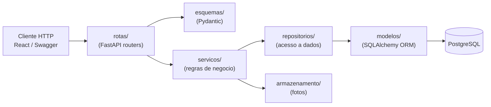
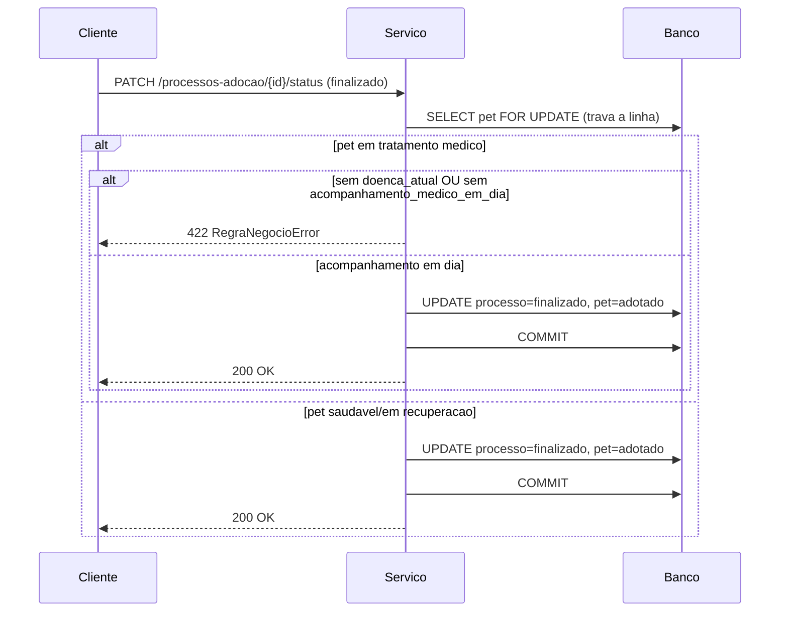

# Arquitetura da PetMeet API

## Visao em camadas

**Por que separar assim (RNF11):**

- **rotas/** so entende HTTP: le o payload, chama o servico certo, devolve a
  resposta. Nao tem regra de negocio.
- **esquemas/** define e valida o formato dos dados que entram e saem da API
  (RF18, RN08). Erros de validacao viram 422 automaticamente pelo FastAPI.
- **servicos/** e onde vivem as regras de negocio (RN01-RN08). E a unica
  camada que decide "pode ou nao pode". Testar essa camada (direto ou via
  HTTP) e testar as regras do negocio.
- **repositorios/** so sabe montar queries SQLAlchemy. Nao decide nada, so
  busca/salva.
- **modelos/** define as tabelas. Constraints de banco (unique, check,
  indices) ficam aqui tambem, como rede de seguranca que sobrevive mesmo a
  bugs futuros nas camadas de cima.

Essa separacao permite trocar qualquer peca sem quebrar as outras: trocar o
banco por outro, trocar o storage de fotos local por S3, ou adicionar uma
interface de linha de comando alem da API HTTP — tudo isso reaproveitaria a
camada de `servicos/` sem alteracao.

## Tratamento de erros (RNF14)

Servicos levantam exceções tipadas (`app/core/excecoes.py`):

| Exceção | HTTP | Quando |
|---|---|---|
| `RegraNegocioError` | 422 | Violação de uma regra de negócio (RN01-RN08) |
| `RecursoNaoEncontradoError` | 404 | Entidade não existe |
| `ConflitoError` | 409 | Conflito de estado/concorrência (RNF18) |
| `NaoAutorizadoError` | 403 | Usuário autenticado sem permissão (RN06) |
| `CredenciaisInvalidasError` | 401 | Login ou token inválidos |

Um handler global (`registrar_tratamento_erros`, chamado em `app/main.py`)
converte cada uma em uma resposta JSON `{"detalhe": "..."}`. Qualquer erro
não previsto vira 500 genérico — o detalhe real vai para o log, nunca para o
cliente.

## Autenticacao e autorizacao (RF20, RF21, RNF01, RNF02)

- Senha nunca é armazenada em texto puro: hash `bcrypt` (`app/core/seguranca.py`).
- Login (`POST /auth/login`) retorna um JWT de acesso.
- `app/dependencias.py::obter_usuario_atual` decodifica o token em toda rota
  protegida.
- `requer_perfil(*perfis)` é uma fábrica de dependência: use-a para restringir
  uma rota a perfis específicos (ex.: `/usuarios` exige `admin`).

## Regra critica: finalizacao de adocao com pet em tratamento medico

Esta é a regra mais sensível do sistema (RN01/RF16), implementada em
`app/servicos/processo_adocao.py::atualizar_status_processo`:

## Concorrencia (RNF18) e a garantia de "um unico processo finalizado" (RN02/RF17)

Duas camadas independentes garantem essa regra:

1. **Lock de linha** (`SELECT ... FOR UPDATE` em `repositorios/pet.py::obter_por_id_com_lock`):
   ao finalizar, a linha do pet fica travada até o commit. Uma segunda
   finalização do mesmo pet (outro processo) espera essa transação terminar
   e, ao continuar, já vê `situacao_adocao == adotado` — sendo rejeitada
   pela checagem explícita antes mesmo de tentar alterar o banco.
2. **Índice único parcial** no banco
   (`processos_adocao (pet_id) WHERE status = 'finalizado'`, criado na
   migration `0001`): é a rede de segurança que garante a regra mesmo se, por
   qualquer motivo, a camada de aplicação falhar em pegar o lock a tempo. Uma
   violação vira `IntegrityError`, capturada no serviço e traduzida para
   `ConflitoError` (HTTP 409).

O teste `testes/test_processo_adocao.py::test_finalizacao_concorrente_do_mesmo_pet_apenas_uma_vence`
reproduz esse cenário com duas conexões de banco reais rodando em paralelo.

## Armazenamento de fotos (RF19)

`app/armazenamento/base.py` define uma interface (`salvar`, `excluir`).
`app/armazenamento/local.py` é a única implementação hoje (disco local, pasta
configurável via `DIRETORIO_UPLOADS`). Para migrar para S3/MinIO no futuro:
crie `app/armazenamento/s3.py` implementando a mesma interface e troque a
fábrica em `app/armazenamento/__init__.py::obter_armazenamento` — nenhuma
rota ou serviço precisa mudar.
