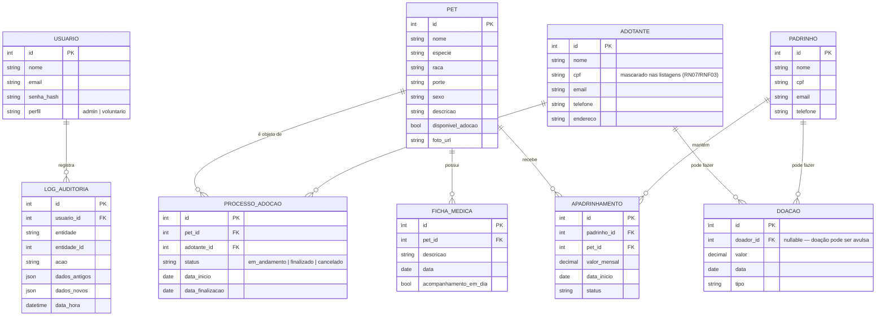

# DER — Diagrama de Entidade-Relacionamento — PetMeet

> Modelo de dados reconstruído a partir do domínio descrito no README, nas regras de negócio (RN01–RN08) e nos requisitos funcionais do projeto. **Este documento não substitui `app/modelos/` nem `docs/MODELO_DE_DADOS.md`** — antes de usar em decisões de handoff, valide os nomes exatos de tabelas/colunas, tipos e constraints diretamente no código-fonte e nas migrations do Alembic.

## Diagrama

## Entidades

| Entidade | Descrição | Status na N1 |
|---|---|---|
| **Usuario** | Equipe da ONG. Dois perfis: `admin` e `voluntario`. Criação de usuários restrita a `admin`. | Entregue |
| **Pet** | Ficha do animal disponível para adoção/apadrinhamento, com foto. | Entregue |
| **FichaMedica** | Histórico médico do pet e se o acompanhamento está em dia — base da trava de RN01. | Entregue |
| **Adotante** | Pessoa que adota um pet. CPF mascarado nas listagens (RN07/RNF03). | Entregue |
| **ProcessoAdocao** | Fluxo de adoção entre um Pet e um Adotante, com status e datas. | Entregue |
| **Padrinho** | Pessoa ou empresa que apadrinha um pet (contribuição recorrente). | Cadastro entregue |
| **Apadrinhamento** | Associação Padrinho ↔ Pet. | Modelo pronto; serviço/rotas pendentes (RF10/RF11 — ver `debitos-tecnicos.md`) |
| **Doacao** | Doação avulsa, associada ou não a um doador cadastrado. | Cadastro entregue; filtros avançados pendentes (RF13) |
| **LogAuditoria** | Registro de alterações relevantes feitas por um usuário. | Modelo pronto; instrumentação pendente (RF22) |

## Regras de negócio críticas refletidas no modelo

- **RN01 (RF16):** `ProcessoAdocao.status` só muda para `finalizado` se a `FichaMedica` mais recente do `Pet` tiver `acompanhamento_em_dia = true`.
- **RN02 (RF17 / RNF18):** dois `ProcessoAdocao` do mesmo `Pet` não podem finalizar ao mesmo tempo — tratado com constraint/lock no banco, não apenas validação na aplicação.
- **RN07 (RNF03):** o `cpf` de `Adotante` (e, por extensão, de `Padrinho`) é mascarado nas listagens da API.

## Fonte e validação

Este DER foi montado a partir do README do repositório, das descrições de PRs mergeadas e das regras de negócio documentadas (RN01–RN08). Ele **não foi extraído diretamente de `app/modelos/`**, então nomes de campos, tipos exatos e relacionamentos opcionais (ex.: se `Doacao.doador_id` de fato existe ou se a doação é sempre anônima) devem ser confirmados pelo time que assumir o projeto, cruzando com:

- `app/modelos/` — definição real das tabelas (SQLAlchemy ORM)
- `alembic/` — histórico de migrations
- `docs/MODELO_DE_DADOS.md` — documentação de dados já existente no repositório